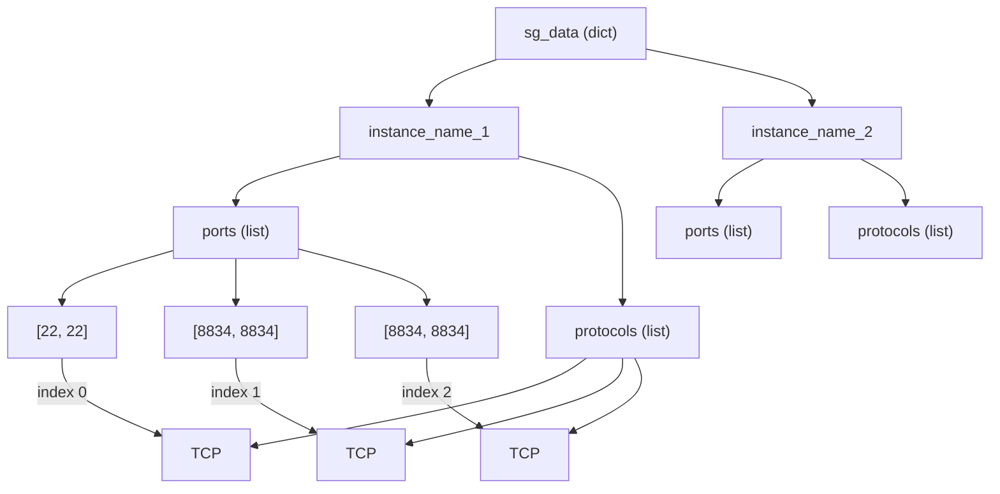

### Data Structure diagram

```mermaid
graph TD
  A["sg_data (dict)"]
  A --> B1["instance_name_1"]
  A --> B2["instance_name_2"]

  B1 --> C1["ports (list)"]
  B1 --> C2["protocols (list)"]

  C1 --> D1["[22, 22]"] 
  C1 --> D2["[8834, 8834]"] 
  C1 --> D3["[8834, 8834]"]

  C2 --> E1["TCP"]
  C2 --> E2["TCP"]
  C2 --> E3["TCP"]

  B2 --> F1["ports (list)"]
  B2 --> F2["protocols (list)"]

  %% Link ports to corresponding protocols
  D1 -- index 0 --> E1
  D2 -- index 1 --> E2
  D3 -- index 2 --> E3
```